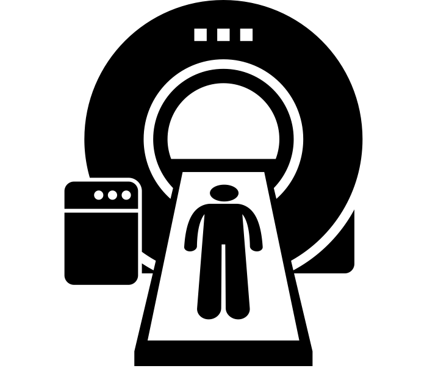

# Predicting Dyslexia with fMRI

This repository contains all code, documents, presentations and results of the project **Predicting the Existence of Dyslexia in Children using fMRI**

The project won the [2017 Wilk Award](https://sipl.eelabs.technion.ac.il/lab-awards/) in the Signal and Image Processing Lab

*Tom Beer, Chen Beer*

logo created by [Gan Khoon Lay](https://thenounproject.com/search/?q=mri&i=1250286) from Noun Project
